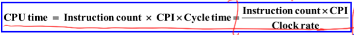

# 컴퓨터 구조 CH1
Introduction of Computer System  

### 컴퓨터의 종류
- Personal Computer  
    - 개인용 컴퓨터
    - 가성비가 중요
- Server  
    - 고성능
    - 매우 비쌈
- Embeded Computer
    - 최소한의 기능

### Instruction Set Architecture __(ISA)__  
- __Instruction__ 
    - 컴퓨터가 수행하는 기본적인 동작.  
- __Instruction Set__
    - Instruction들의 모음 (사전)
- __ISA__
    - computer system의 특성들
    - Instruction set, Instruction format, Data storage, Addressing modes, Exceptional conditions를 포함한다.  
    - Software와 Hardware의 연결고리  

### Porformance  
- Response time
    - 특정 작업을 수행하는데 걸리는 시간
- Throughput
    - 단위시간당 수행하는 작업량  

- CPU time(CPU execution time)
    - 작업을 수행하기 위해서 CPU가 소모한 시간  

- Clock 
    - 일정한 주기의 구형파, 사인파  
    - 컴퓨터는 클럭을 기준으로 동작을 수행함.  
- Clock Cycle
    - 클럭의 한 주기
    - 컴퓨터는 클럭 사이클을 단위로 기본적인 동작을 수행  
- Clock period
    - 한 클럭 사이클의 시간  

### CPU Time
CPU 성능은 user CPU time으로 측정  

- CPI
    - instruction 1개당 소모되는 clock cycle의 수

### Amdahl's Law
어떤 업그레이드에 의한 성능향상은 그 업그레이드에 영향을 받는 부분만 성능향상이 일어난다.  
