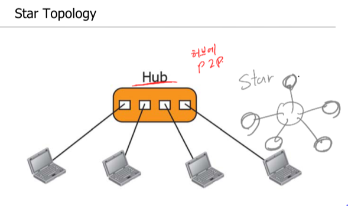

# 데이타통신 CH1
데이터 통신 소개  

### __데이타통신이란?__  
매체를 통해 두 장치간에 데이터를 교환하는 것이다.  

데이터 통신의 구성요소에는 Message, Sender, Receiver, Transmission medium, Protocol 이 있다.  

### __Topology__  
토폴로지란 장치들을 연결할 때, 연결하는 방식을 나타낸다.  
Mesh, Star, Bus, Ring의 네가지 기본 토폴로지가 있다.  

|  | 
--- | ---
|  | 

### __네트워크의 종류__  
- LAN(Local Area Network)  
    - 개인 사무실이나 건물 등에서 주로 사용.
    - 수 킬로미터의 크기
    - 100~1000 Mbps의 속도
    - bus, ring, star topology 이용
- WAN(Wide Area Network)
    - 국가나, 대륙, 혹은 세계를 연결
    - point-to-point WAN  
    - Wireless WAN 
- MAN(Metropolitan Area Network)
    - 하나의 도시를 커버함

