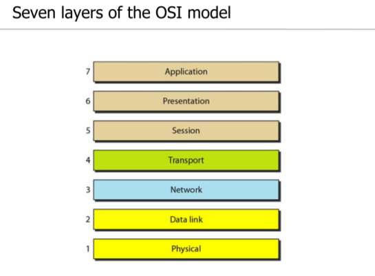

# 데이터 통신 CH2  
네트워크 모델

### Layered Task  
네트워크 통신을 할 때, 단계를 여러개로 나눔으로써, 각 단계에서 특정한 업무만 수행하는 분업의 역할을 한다.  

### OSI MODEL
Open System Interconnection  
7개의 layer로 구성된다.  
  

- OSI모델에서 상위 4계층(Application, Presentation, Session, Transport)는 End-to-End 형태로 데이터를 전달하고, 하위 3계층(Network, Datalink, Physical)는 hop by hop형태로 데이터를 전달한다.  
- 데이터는 매 계층을 통과할 때 마다. 헤더를 부착하고(Encapsulation), 삭제하면서(Decapsulation) 새로운 데이터 유닛을 형성한다.  
- Data link 계층에서는 헤더와 트레일러를 함께 부착해서 프레임을 형성한다.  

### 각 Layer가 하는 일
- Application
    - Allow access to network resources
- Presentation
    - Translate, encrypt, and compress data
- Session
    - Establish, manage, and terminate sessions
- Transport
    - Provide reliable process-to-process message delivery and error recovery
- Network
    - Move packets from source to destination
- Data Link
    - Organize bits into frames
- Physical
    - Transmit bits over a medium

### TCP/IP Protocol
TCP/IP 프로토콜의 계층은 OSI모델과는 다르게 5개의 계층(physical, datalink, network, transport, application)으로 이루어져있다.  
