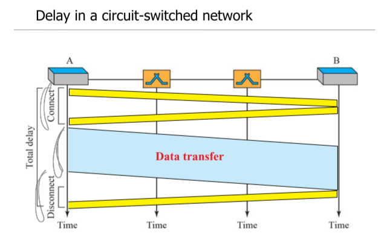

# 데이타 통신 CH8  
Switching Network  

### Circuit Switching Network  
physical link로 연결된 스위치들로 구성된 네트워크  
각 스위치마다 n개의 채널로 데이터를 전송하며 FDM, TDM을 통해 데이터를 전송한다.  

두 노드간 전용채널을 구성하여 데이터를 전송하는데, 세가지 단계로 나뉜다.  
- Estabilish
    - 두 노드간 연결을 만드는 단계  
- Transfer 
    - 연결된 채널을 통해 데이터를 전송하는 단계  
- Disconnect  
    - 데이터 전송이 끝나면 채널을 닫는 단계  

### Datagram Packet Switching Network  
노드간에 채널을 연결하지 않고, 각 데이터를 패킷으로 만들어 전송하는 방식.  

채널을 만들지 않기 때문에 각 패킷에는 도착지에 대한 정보가 들어있어야 한다.  

  

### Virtual Circuit Packet Switching Network  
두 노드를 연결하는 가상의 채널을 만들어서 데이터를 전송하는데 사용.  

가상의 채널이기 때문에 다른 노드도 이 채널을 사용할 수 있다.  

  
